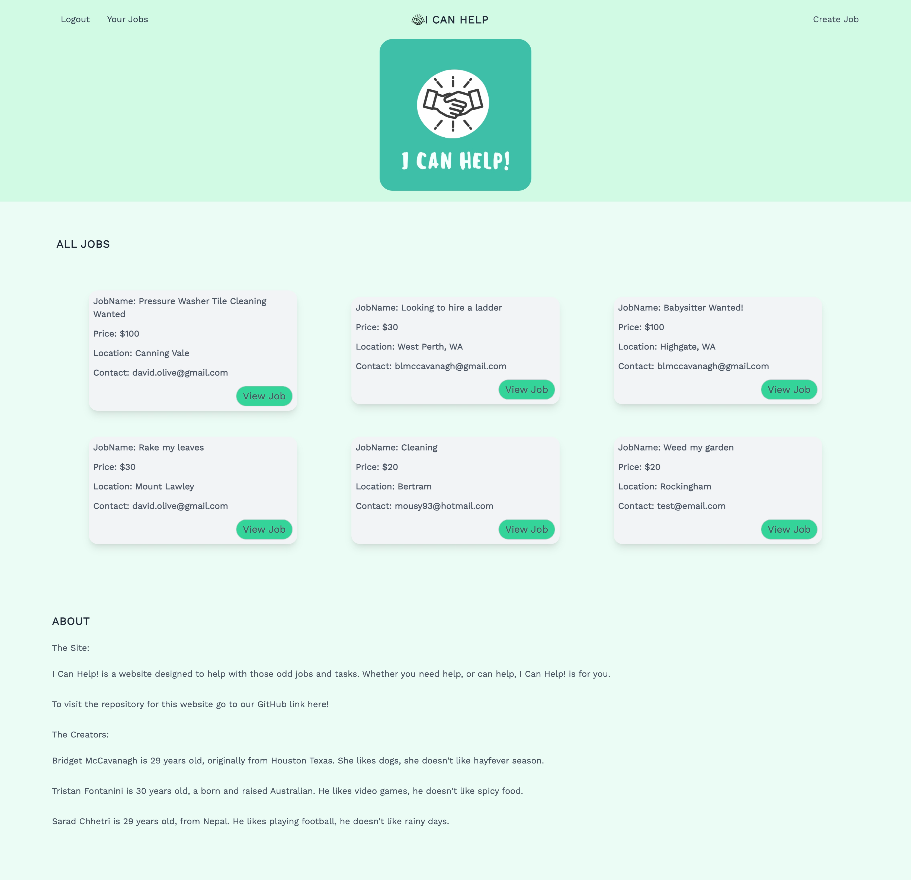

# I Can Help! Work Marketplace

## This GitHub repository contains the code and database schema for "I Can Help!", a community platform that connects people who need to outsource tasks and find local services, with people who are looking to earn money and ready to work.

---

### This application provides a web based marketplace for listing jobs or tasks using a clean, simple and easy to use interface. The focus of the website was not to provide ongoing employment opportunities but rather to address a specific identified gap in the market around completion of one time tasks or odd jobs. Users on the site are able to add listings requesting assistance, or are able to respond to these listings, agreeing to complete the task for the user who has posted the job.

I Can Help! was developed to provide a platform on which to request assistance for people who are time poor, or unable to complete a job due to a lack of expertise; or for those who would simply rather pay somebody else to do it! With the COVID-19 pandemic affecting employment, particularly for younger people, this also serves to provide small employment opportunities to enable people to make additional income.

Contact details are exchanged for both the poster and the tasker and the poster is notified by email that their job has been accepted.

---

## Table Of Contents

* [Motivation and Approach](#motivation-and-approach)
* [Development](#development)
  * [Technology and Platform Selection](#technology-and-platform-selection)
  * [Challenges and Successes](#challenges-and-successes)
  * [Future Development Opportunities](#future-development-opportunities)
* [Deployed Application Link](#deployed-application-link)
* [Repository Link:](#repository-link)
* [Application Screenshots:](#application-screenshots)
* [Infomercial:](#infomercial)

---

## Motivation and Approach

In developing I Can Help! After prototyping the User Story Map the team decided to split the work into individual tasks, and through collaboration utilising class time and using Discord to screen share, work was divided evenly and developed by each individual member, while maintaining change control using GitHub.

Development was performed collaboratively, with frequent communication on the status of each task as it was developed and refined by each member of the team. Each member brought their individual strengths to the development process, allowing for a better end product. When issues were encountered, other members of the team would often take a look at the issue, again allowing for a collaborative process. Communication was key, in the process of building I Can Help! we encountered zero merging conflicts, an indication of great success as a group.

As the application contains front end and back end components, this was a logical choice to further segment the work packages, and individual branches for both sides were utilised within GitHub to facilitate this development to occur independently, allowing for the most efficient use of the time allocated to the project.

---

## Development

### Technology and Platform Selection

In order to build I Can Help! we had to implement multiple technologies. This includes the storage and utilisation of user information, the data used to populate and display job listings, and the ability for users to post and accept job postings. Storing and managing this data required the use of a database backend to store data used by the application. MySQL was chosen as the database platform due to its flexibility and its choice as an industry standard.

Our application allows users to sign up and store user information so security was an important aspect of the site design. Our application uses bcrypt, a password hashing function, to ensure that every user's login information is encrypted and protected, and provides authenticated access to the site for each unique user. Deploying on Heroku as our application platform also allowed us to utilise Secure Socket Layer (SSL) encryption, ensuring that user data that is captured by the application is secured.

User notifications are required to update users when jobs that have been posted are accepted by another user of the site. Nodemailer was chosen as the notification engine for I Can Help!, notifying a user when their job has been accepted, and sending them the contact details and other pertinent information for the job to be performed.

Our presentation layer includes the use of Express-Handlebars, a templating engine that was used to render the HTML and CSS on the client side device, from data that has been stored in the server side database. This provided a repeatable, templated interface for each job posted, providing a consistent user experience across web and mobile.

We utilised the CSS framework Tailwind when styling the application. As we were working with Node.js, we installed the tailwindcss package.

The application is deployed on Heroku, a cloud application platform.

Links to the languages and tools used to build this project are included below:

* HTML 5
* Javascript ES6
* CSS3
* CSS Framework
    * Tailwind CSS :
        * https://tailwindcss.com/
* Google Fonts :
    * https://fonts.google.com/
* Font Awesome Icons :
    * https://fontawesome.com/icons?d=gallery&p=2
* Canva :
    * https://www.canva.com/
* MySQL :
    * https://www.mysql.com/
* Node.js :
    * https://nodejs.org/
* NPM :
    * https://www.npmjs.com/
* NPM Packages
    * Bcrypt :
        * https://www.npmjs.com/package/bcrypt
    * Connect-Session-Sequelize :
        * https://www.npmjs.com/package/connect-session-sequelize
    * Dotenv :
        * https://www.npmjs.com/package/dotenv
    * Express :
        * https://expressjs.com/
    * Express Handlebars :
        * https://www.npmjs.com/package/express-handlebars
    * Express Session :
        * https://www.npmjs.com/package/express-session
    * Handlebars :
        * https://handlebarsjs.com/
    * MySQL2 :
        * https://www.npmjs.com/package/mysql2
    * Nodemailer :
        * https://nodemailer.com/about/
    * Nodemon
        * https://nodemon.io/
    * Sequelize :
        * http://sequelize.org/
    * Tailwind :
        * https://tailwindcss.com/

### Challenges and Successes

Implementing the use of Nodemailer, a new NPM package we hadn’t used before, provided one of our biggest challenges. Understanding it’s behaviour and functionality were initially difficult, but as we researched and learned to understand how to employ this package we were able to utilise it as a tool providing a notification service for our application.

Successfully deploying our application to Heroku was one of our biggest successes. Aside from a few minor syntax errors that were easily fixable, I Can Help! is up and running with all the functionality we had planned for our version 1 release. 

### Future Development Opportunities

As part of the development of I Can Help! we identified a number of focus areas to improve the application in the future.

Adding the ability to rank and review job posters by implementing a user based rating system would allow for more confidence in selecting users to perform the various jobs that are posted to the platform, and allow for users to provide reviews of how the jobs were performed, increasing user confidence and satisfaction.

Providing more abilities for end users to filter and sort the available jobs would allow for better targeting of relevant jobs and a better user experience in finding and responding to jobs that they can perform. Filtering by price, rating and area is also planned for the future.

Expanding functionality to allow users to post jobs that they are willing to perform, or areas of expertise that they possess, including the ability to verify qualifications for those with a trade certificate for example, will further drive the site's utilisation and user engagement, as users will be able to choose to employ a resource to perform a task they may not have thought to post themselves.

Building on the existing notification engine deployed on I Can Help!, utilising additional notification mediums such as SMS notifications would ensure that users are aware of jobs being accepted.  Allowing for other forms of notifications such as job updates would provide users with additional information as to how their job is progressing, providing a richer experience.

Finally, implementing a payment platform would provide for new opportunities to monetize I Can Help!. This would also provide a superior user experience by keeping user payments within the site, without users having to exchange cash or organise a form of payment themselves, as well as serving to offer payment protection options.

---

 

**Thank you for visiting.**

---

### Deployed Application Link:

* https://i-can-help-work-market-place.herokuapp.com/

---

### Repository Link:

* https://github.com/Twistedmouse/I-CAN-HELP-WorkMarketPlace

---

### Application Screenshots:

*Sign In Page*

---

*Sign Up Page*

---

*Homepage*

---

*Create a Job*

---

*Your Jobs*

---

### Infomercial:

<a href="https://drive.google.com/file/d/1LBS-JzbnrEnB2cnLxHnSzkDsZb10dtEF/view?usp=sharing">Click here to watch the video!</a>

---